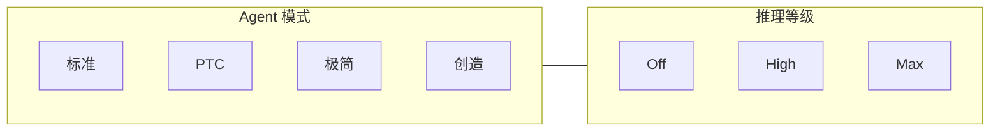

# DeepSeek Harness：Agent 模式 × 推理等级

分析版本：`master@47f943859bef60e4160492346772ded9b24f765a`。
用途：讲解备忘，含口径、禁区和被问到时的答法。
给同事和领导直接看的展示稿：[agent-modes-and-reasoning.md](agent-modes-and-reasoning.md)。
完整实现追踪：[agent-presets-and-reasoning.md](agent-presets-and-reasoning.md)。

讲解节奏：

| 时长 | 讲到哪里停 |
|---|---|
| 5 分钟 | §1 两条轴 + §2 模式总表 + §3 等级总表 + §5 推荐组合 |
| 10 分钟 | 再讲 §4 四个组合长什么样 + §6 口径和禁区 |
| 15 分钟 | 补 §2.2 能力矩阵、§7 移植启示；细节只在被问到时翻附录 |

---

## 1. 先看结论

Harness 把两件事拆开，互不包含：

```text
Agent 模式：这个会话能做什么、怎么用工具
推理等级：同一次模型请求想多深
```



因此 `标准 + Max`、`PTC + Off`、`极简 + High` 都合法。模式不选模型，等级不增删工具。

四个必须先讲清的判断：

| # | 判断 | 不要讲成 |
|---|---|---|
| 1 | 标准是默认通用方案 | 标准 = 最强推理 |
| 2 | PTC 是工具编排协议，不是更强标准模式 | PTC = 更高智力 / 更多工具 |
| 3 | 极简是独立双工具组装，不是标准少几个工具 | 极简 = 标准的精简开关 |
| 4 | 创造是开发 Harness / preset 的高权限模式 | 创造 = 创意写作 |

推理等级只改 DeepSeek 请求字段：

| 等级 | 请求字段 | 仓库能证明的事 |
|---|---|---|
| Off | `thinking: disabled` | 显式关闭 thinking |
| High | `thinking: enabled` + `reasoning_effort: high` | 默认档 |
| Max | `thinking: enabled` + `reasoning_effort: max` | 请求官方最高档 |

High 与 Max 的 token、时延、费用、质量差由 DeepSeek 服务端决定，本仓库不能量化。

产品默认建议：

```text
默认：标准 + High
工具流水线：PTC + High
高复杂度：标准 / 创造 + Max
受控实验：极简 + 固定等级
```

---

## 2. 四种模式对比

### 2.1 一页总表

| | 标准 | PTC | 极简 | 创造 |
|---|---|---|---|---|
| 稳定 id | `standard` | `code` | `minimal` | `cordis` |
| Web 默认 | 是 | 否 | 否 | 否 |
| 一句话 | 完整工具，直接调用 | 完整工具，代码编排 | 固定提示词，双工具 | 标准能力 + 开发 Agent 本身 |
| 模型直接看到的工具 | 每个原生工具一份 schema | 只有 `run_code` | 持久 Bash + `str_replace_editor` | 标准工具 + 7 个 Cordis 工具 |
| 底层工具还在吗 | 是 | 是，经 SDK 间接到达 | 只组装这两个 | 是 |
| 提示词 | 完整 persona + 工具指导 + runtime | 同标准，再加 SDK | 一句固定人设，压制其它段 | 标准 + Harness/Cordis 人设 |
| 和标准的配置差 | 基线 | 只多一行 `mode: code` | 整份独立组装 | 标准 + `tool-cordis` + 两个 Skills |
| 主要收益 | 直观、适应动态任务 | 一次程序里组合多步工具 | 协议稳定、上下文短 | 可检查运行时、写自定义 preset |
| 主要代价 | 工具 schema 多 | SDK 占 prompt；单次调用未必更快 | 无搜索 / Skills / 压缩 / 委派 | 权限接近 Bash，不适合普通用户 |

### 2.2 能力矩阵

| 能力 | 标准 | PTC | 极简 | 创造 |
|---|:---:|:---:|:---:|:---:|
| 文件读写 / 编辑 | ✓ | ✓ via SDK | 仅编辑器 | ✓ |
| Bash / PowerShell | 一次性 | ✓ via SDK | 持久 PTY | 一次性 |
| glob / grep | ✓ | ✓ via SDK | — | ✓ |
| Web 搜索 | ✓ | ✓ via SDK | — | ✓ |
| Skills | ✓ | ✓ | — | ✓ + 两个创作 Skills |
| Plan / Goal / Todo | ✓ | ✓ | — | ✓ |
| 上下文压缩 | ✓ | ✓ | — | ✓ |
| Subagent / Workflow / Ralph | ✓ | ✓ | — | ✓ |
| 后台任务 | ✓ | ✓ | — | ✓ |
| 固定完整 system prompt | — | — | ✓ | — |
| Runtime context | ✓ | ✓ | 抑制 | ✓ |
| 检查 / 修改运行时 | 普通 shell/fs | 普通 shell/fs | — | 专用 Cordis 工具 |

读表口诀：

```text
标准 ≈ PTC 的能力面
极简 ≠ 标准减配
创造 = 标准 + 自修改
```

### 2.3 四种模式各讲一句

**标准。** 模型直接发 `bash` / `read` / `web_search` 等。适合普通编码、调研、路径不好提前写死的任务。没有特殊需求时用它。

**PTC。** 插件表与标准相同，只把呈现改成 Code Mode。模型只能直接调 `run_code`，在 TypeScript 里写 `tools.read()` / `tools.grep()`。执行层会把绕过 `run_code` 的直调打成 `UNKNOWN_TOOL`。价值是少一轮「模型 → 工具 → 模型」，不是多一套能力。

**极简。** 人设固定为 `You are a helpful software engineer assistant.`，并且 `complete: true`。只有持久 Bash 和 `str_replace_editor`。没有压缩，长会话不会自动获得标准模式的裁剪。适合 benchmark / RL / 受控 Shell 实验。

**创造。** 标准能力之外增加 `cordis_inspect_*` / `define` / `run` / `stop` / `undefine`。`cordis_run` 在进程内跑模型提交的 JS，动态包不自动落盘。适合写自定义 preset，应按 Bash 同级信任，不要对普通业务用户开放。

---

## 3. 三个推理等级对比

| | Off | High | Max |
|---|---|---|---|
| Harness 值 | `off` | `high` | `max` |
| DeepSeek 字段 | `thinking.disabled`，不发 `reasoning_effort` | `thinking.enabled` + `high` | `thinking.enabled` + `max` |
| 默认吗 | 仅当部署锁死 `thinking: disabled` | 是 | 否 |
| 改工具表吗 | 否 | 否 | 否 |
| 改 system prompt 吗 | 否 | 否 | 否 |
| 改权限吗 | 否 | 否 | 否 |
| 本仓库有独立 token 上限吗 | 否 | 否 | 否 |
| 官方建议场景 | — | 日常 Agent 任务 | 更复杂 / 高度复杂的任务 |

切换等级**不会**改 preset、工具、提示词、PTC、沙箱或 `maxTokens`。

High 与 Max 的调用差异只有请求体里的 `reasoning_effort`：都是 `POST {baseURL}/chat/completions` + `thinking.enabled`，High 发 `"high"`，Max 发 `"max"`。官方映射后仍是这两档，不会互相折叠。接口、工具回传、单价、1M 上下文和 384K 最大输出都相同；官方没有公布两档的思考 token 上限。费用差只可能来自 Max 生成更多 `reasoning_tokens`。官方另外有 `low` 档，Harness 不提供。

标题生成是唯一例外：`purpose: session-title` 无条件 `thinking: disabled`，不影响对话请求。

四任务实测用的是 `标准 + Max`，这是当时的模型选择，不是标准模式自带默认。

---

## 4. 组合之后，模型实际看到什么

同一 DeepSeek 模型下，四组合法请求长这样：

### 标准 + Max

```text
system = 标准人设 + 工具指导 + runtime / skill
tools  = bash, read, write, edit, web_search, skill, ...
wire   = thinking.enabled + reasoning_effort=max
调用   = 模型直接发工具名
```

### PTC + High

```text
system = 标准人设 + 工具指导 + code-only 规则 + TypeScript SDK
tools  = [run_code]
wire   = thinking.enabled + reasoning_effort=high
调用   = 模型写一段 TS；程序内 tools.bash() / tools.read()
```

### 极简 + Off

```text
system = "You are a helpful software engineer assistant."
tools  = [persistent bash, str_replace_editor]
wire   = thinking.disabled
调用   = 只有这两个原生工具
```

### 创造 + Max

```text
system = Harness / Cordis 人设 + 标准工具指导 + 创作 Skills
tools  = 标准工具 + 7 个 Cordis 工具
wire   = thinking.enabled + reasoning_effort=max
调用   = 普通工具直调，外加运行时检查 / 动态包
```

PTC 对比用这张图讲最清楚：

```text
标准：read → 看结果 → grep → 看结果 → write     （三轮模型）
PTC ：一次 run_code 里完成 read + grep + write   （一轮模型）
```

---

## 5. 怎么选

| 任务 | 模式 | 等级 | 为什么 |
|---|---|---|---|
| 普通编码、改仓库 | 标准 | High | 能力完整，默认档够用 |
| 复杂架构 / 高风险变更 | 标准 | Max | 保留动态决策，请求更强思考 |
| 多文件批处理、检索聚合 | PTC | High / Max | 循环和过滤适合写成程序 |
| 只调一次工具的小事 | 标准 | Off / High | PTC 的 SDK 反而更贵 |
| 简单确定性 Shell | 极简 | Off / High | 工具面小，PTY 状态可保留 |
| 编码 benchmark / RL | 极简 | 实验内固定 | 协议和上下文必须稳 |
| 写自定义 preset | 创造 | High | 有专用工具和 Skills |
| 复杂 Cordis 插件实验 | 创造 | Max | 约束多、权限高 |
| 摘要 / 格式转换 | 标准 | Off | 不必开 thinking |

---

## 6. 讲解口径

### 开场（约 30 秒）

> Harness 把「Agent 能做什么」和「模型想多深」拆成两条轴。模式决定工具、提示词和呈现方式；等级只改 DeepSeek 的 thinking 字段。PTC 不是推理档，Max 也不是一种 Agent 模式。

### 四种模式（约 1 分钟）

```text
标准：完整工具，直接调用
PTC：完整工具，代码编排
极简：固定提示词，双工具
创造：标准能力，外加开发 Agent 本身
```

### 三个等级（约 30 秒）

```text
Off：关掉 thinking
High：默认档
Max：请求最高档；收益和成本由服务端和任务决定
```

### 五个不要讲错的点

1. 不要说「Max 一定更慢 / 更贵 / 更好多少」——官方只建议复杂任务用 Max，没有公布预算或单独价目；单价相同，费用随思考 token 走。
2. 不要说「PTC 工具更多」——工具面与标准相同，只是模型接口收敛成 `run_code`。
3. 不要说「极简 = 标准关掉几个开关」——它是另一份组装，提示词也换成 complete。
4. 不要把极简工具说明里的「无互联网」当成强制断网——断网靠宿主 sandbox。
5. 不要把创造模式开放给未审核用户——`cordis_run` 按 Bash 同级信任。

### 被问到实现时，各用一句

| 问题 | 答法 |
|---|---|
| 预设怎么挂上的？ | 按 preset id 做 standing mount，会话只绑定过去；不是每会话重装整棵插件树。 |
| 会话中途能换模式吗？ | 只能在还没有 `turn/start` 的空白会话换；开始后拒绝，避免历史里出现新模式没有的工具。 |
| PTC 会不会被模型绕过？ | 不会。执行入口和 schema 用同一条规则，直调原生工具会变成 `UNKNOWN_TOOL`。 |
| 等级存在哪？ | 每步有效请求写入 `request/header`，会话可重建。 |
| 和四任务追踪什么关系？ | 那四次都是 `标准 + Max`，所以每步请求头都是 Max，这不是标准模式默认。 |

---

## 7. 移植到内部智能体时保留的拆分

不要做成「一个模式枚举里同时选工具和思考强度」。保留同样的正交：

```text
AgentProfile
  persona / tools / skills / compaction / delegation / toolPresentation

ModelSelection
  provider / model / reasoningEffort
```

这样可以：

- 同一模式换等级，同一模型服务不同权限组合；
- 不把模型路由复制进每套 Agent 配置；
- 把 PTC 做成工具呈现层，而不是第二套工具系统。

---

## 附录 A. 两条轴的落地位置

| 轴 | 决定内容 | 所有者 | 记在哪 |
|---|---|---|---|
| Agent 预设 | 工具、提示词、Skills、压缩、委派、呈现 | `dsh-agent-presets` + 各 `agent.cordis.yml` | 创建时 `SessionHeader.agentPreset`；空白切换写 `agent-preset/selected` |
| 推理等级 | adapter-owned `reasoningEffort` → DeepSeek `thinking` / `reasoning_effort` | `dsh-llm` + `dsh-llm-deepseek` | 每步 `request/header.header.config.reasoningEffort` |

Preset 链路：

```text
apps/cli/config/agent-presets/<id>/{preset.yml, agent.cordis.yml}
  → profile-boot 注入 system root
  → dsh-agent-presets 发现并 ensureStanding
  → Agent scope parent binding
  → 本 scope 解析 prompt / tools
```

Reasoning 链路：

```text
DeepSeekAdapter 公布 Off/High/Max
  → ApiProxy 模型目录
  → Web ModelSelect
  → session.selectModel
  → agent/request 快照
  → prepareCall 校验
  → request/header
  → serializeRequest
```

---

## 附录 B. 关键文件

预设定义：

- [标准](../../apps/cli/config/agent-presets/standard/agent.cordis.yml)
- [PTC](../../apps/cli/config/agent-presets/code/agent.cordis.yml)
- [极简](../../apps/cli/config/agent-presets/minimal/agent.cordis.yml)
- [创造](../../apps/cli/config/agent-presets/cordis/agent.cordis.yml)

生命周期与 PTC：

- [standing mount](../../packages/preset/agent-presets/src/index.ts)
- [空白会话切换](../../packages/host/apiproxy/src/api-proxy.ts)
- [呈现切换](../../packages/core/agent-tool-presentation/src/index.ts)
- [schema / 执行收敛](../../packages/core/tools/src/index.ts)
- [`run_code`](../../packages/core/tools/src/code-mode.ts)

推理等级：

- [Off/High/Max 定义](../../packages/llm/llm-deepseek/src/adapter.ts)
- [wire 序列化](../../packages/llm/llm-deepseek/src/serialize.ts)
- [请求头记录](../../packages/core/agent-loop/src/agent.ts)

---

## 收束句

> 标准强调完整和直接，PTC 强调程序化编排，极简强调固定和受控，创造强调开发 Agent 本身。Off / High / Max 只控制 thinking，不改变 Agent 能力。默认用标准 + High；只有编排、实验或高权限开发这三类需求，才离开这条基线。
