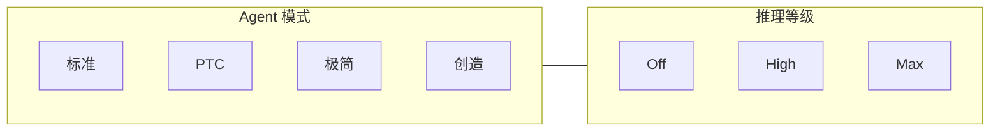

# DeepSeek Harness：Agent 模式与推理等级

Web 与 CLI 提供两条互相独立的选择：

- **Agent 模式**决定这个会话能做什么、怎么使用工具。
- **推理等级**决定同一次模型请求的思考强度。

二者可以自由组合。模式不选择模型，等级不增删工具。




---

## 四种模式

PTC 全称是 **Programmatic Tool Calling**（程序化工具调用）。中文界面称为「PTC 模式」，英文界面称为 Code mode：模型不直接点选各个工具，而是写一段 TypeScript 程序，在程序里组合调用。


|         | 标准               | PTC                     | 极简                           | 创造                    |
| ------- | ---------------- | ----------------------- | ---------------------------- | --------------------- |
| 定位      | 完整通用编码 Agent     | 用代码编排同一套工具              | 固定协议的双工具环境                   | 开发 Harness 与自定义 Agent |
| 模型如何用工具 | 直接调用每个工具         | 只调用 `run_code`，在程序里组合工具 | 直接调用两个工具                     | 与标准相同，并增加运行时扩展工具      |
| 能力范围    | 完整               | 与标准相同                   | 仅 Shell + 文件编辑               | 标准 + 运行时检查与扩展         |
| 适合      | 日常编码、调研、路径不固定的任务 | 批量处理、检索聚合、可写成程序的流水线     | 受控实验、benchmark、以 Shell 为主的任务 | 编写自定义 Agent、实验插件      |
| 不适合     | —                | 只调用一次工具的简单任务            | 需要搜索、Skills、压缩或委派的通用任务       | 普通业务用户、低权限环境          |
| 默认      | 是                | 否                       | 否                            | 否                     |


一句话对照：

```text
标准：完整工具，直接调用
PTC：完整工具，写成程序再执行
极简：固定提示词，只保留 Shell 和编辑器
创造：标准能力，外加开发 Agent 本身
```


### 能力对照


| 能力            | 标准  | PTC | 极简   | 创造  |
| ------------- | --- | --- | ---- | --- |
| 文件读写 / 编辑     | ✓   | ✓   | 仅编辑器 | ✓   |
| 命令行           | ✓   | ✓   | 持久会话 | ✓   |
| 文件搜索          | ✓   | ✓   | —    | ✓   |
| 网页搜索          | ✓   | ✓   | —    | ✓   |
| Skills        | ✓   | ✓   | —    | ✓   |
| 计划 / 目标 / 待办  | ✓   | ✓   | —    | ✓   |
| 长会话压缩         | ✓   | ✓   | —    | ✓   |
| 子 Agent / 工作流 | ✓   | ✓   | —    | ✓   |
| 检查和扩展运行时      | —   | —   | —    | ✓   |


要点：

- **PTC 不是更强的标准模式。** 能力面相同，差别是模型一次提交一段程序，在程序里连续调用多个工具，减少「看结果再决定下一步」的往返。
- **极简不是标准模式的精简开关。** 它是另一套组装：提示词固定，只保留两个工具，也没有长会话压缩。
- **创造不是创意写作模式。** 它面向内部开发者，可以检查运行时并创建自定义 Agent，权限与命令行同级。

标准与 PTC 的工作方式：

```text
标准：读文件 → 看结果 → 搜索 → 看结果 → 写文件
PTC ：一次程序里完成 读文件 + 搜索 + 写文件
```

---


## 三个推理等级


|          | Off                                        | High                                           | Max                                           |
| -------- | ------------------------------------------ | ---------------------------------------------- | --------------------------------------------- |
| 作用       | 关闭思考                                       | 默认思考档                                          | 最高思考档                                         |
| 请求字段     | `thinking: disabled`，不发 `reasoning_effort` | `thinking: enabled` + `reasoning_effort: high` | `thinking: enabled` + `reasoning_effort: max` |
| 是否默认     | 否                                          | 是                                              | 否                                             |
| 是否改工具或权限 | 否                                          | 否                                              | 否                                             |
| 官方建议场景   | —                                          | 日常 Agent 任务                                    | 更复杂 / 高度复杂的任务                                 |


切换等级只改变发给 DeepSeek 的思考强度字段，不改变 Agent 模式、工具列表、提示词或权限。

### High 与 Max 的调用差异

二者走同一接口：`POST https://api.deepseek.com/chat/completions`（`baseURL` 可覆盖）。差别只在请求体里的 `reasoning_effort` 字符串。


|              | High                           | Max                       |
| ------------ | ------------------------------ | ------------------------- |
| 思考开关         | `thinking.type = enabled`      | 相同                        |
| 思考强度字段       | `"high"`                       | `"max"`                   |
| 官方映射结果       | 仍是 high                        | 仍是 max                    |
| 官方建议         | 日常 Agent 任务                    | 更复杂的任务；复杂 Agent 场景建议用 max |
| 接口、模型、工具回传规则 | 相同                             | 相同                        |
| 单价、上下文、最大输出  | 相同：按 token 计费；上下文 1M；输出最长 384K | 相同                        |


官方文档没有公布 High 与 Max 各自的思考 token 上限、时延倍数或单独价目。费用差只可能来自 Max 通常会生成更多 `reasoning_tokens`，不是另一套单价。

官方 API 另外还有 `low` 档（简单任务）。Harness 界面只提供 Off / High / Max，不会发出 `low`。

来源：[思考模式](https://api-docs.deepseek.com/zh-cn/guides/thinking_mode)、[Chat Completions](https://api-docs.deepseek.com/zh-cn/api/create-chat-completion)、[更新日志 2026-08-13](https://api-docs.deepseek.com/zh-cn/updates)、[V4-Pro 正式版说明](https://api-docs.deepseek.com/zh-cn/news/news260813/)、[模型与价格](https://api-docs.deepseek.com/zh-cn/quick_start/pricing)。

---


## 常见组合

同一模型下，四种常见组合如下。

**标准 + High（默认）**

完整工具，模型直接调用；思考强度为默认档。适合大多数日常任务。

**PTC + High**

工具能力与标准相同，但模型通过一段程序编排多个步骤。适合批量文件处理、检索和聚合。

**极简 + Off / High**

只有命令行和文件编辑，提示词固定。适合协议需要保持稳定的实验。

**标准 / 创造 + Max**

保留完整（或开发向）工具，并请求最高思考档。适合约束多、风险高的任务。创造模式仍只应开放给受信任的开发者。

---


## 使用建议


| 任务               | 模式  | 等级         |
| ---------------- | --- | ---------- |
| 日常编码、修改仓库        | 标准  | High       |
| 复杂架构分析、高风险变更     | 标准  | Max        |
| 多文件批处理、检索与聚合     | PTC | High 或 Max |
| 只调用一次工具的小事       | 标准  | Off 或 High |
| 摘要、格式转换          | 标准  | Off        |
| 受控 Shell 实验、编码评测 | 极简  | 实验内固定一档    |
| 编写自定义 Agent      | 创造  | High       |
| 复杂插件实验           | 创造  | Max        |


推荐默认：

```text
日常使用：标准 + High
工具流水线：PTC + High
高复杂度任务：标准 + Max
受控实验：极简 + 固定等级
内部平台开发：创造 + High / Max
```

---


## 对内部智能体的启示

如果把这套能力接到内部系统，建议继续把「Agent 能力」和「模型思考强度」分开配置：

```text
Agent 配置：人设、工具、技能、压缩、委派、工具呈现方式
模型配置：供应商、模型、推理等级
```

这样可以：

- 同一套 Agent 能力搭配不同思考强度；
- 同一个模型服务不同权限和工具组合；
- 把 PTC 做成工具的使用方式，而不是再做一套工具。

---

实现追踪：[agent-presets-and-reasoning.md](agent-presets-and-reasoning.md)